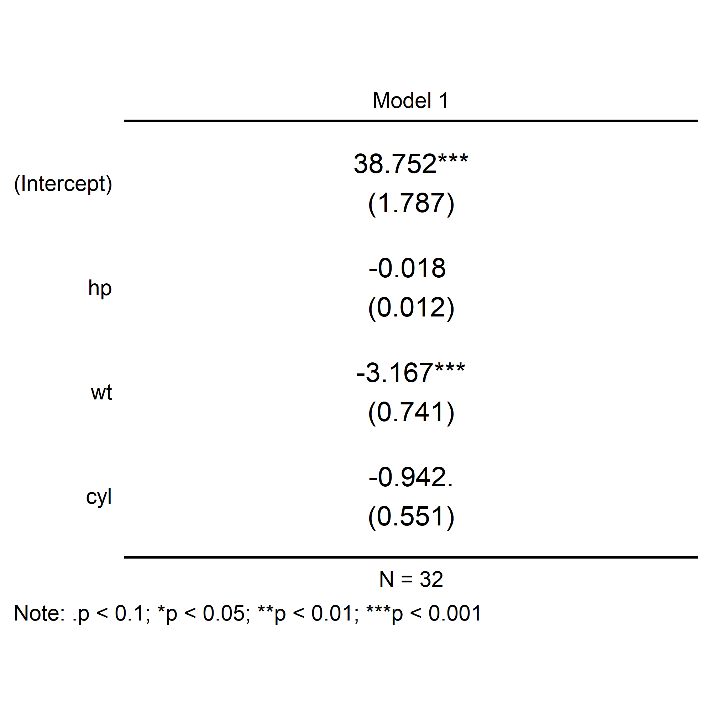
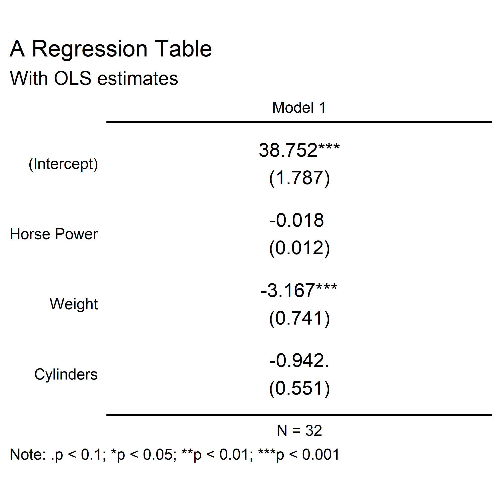
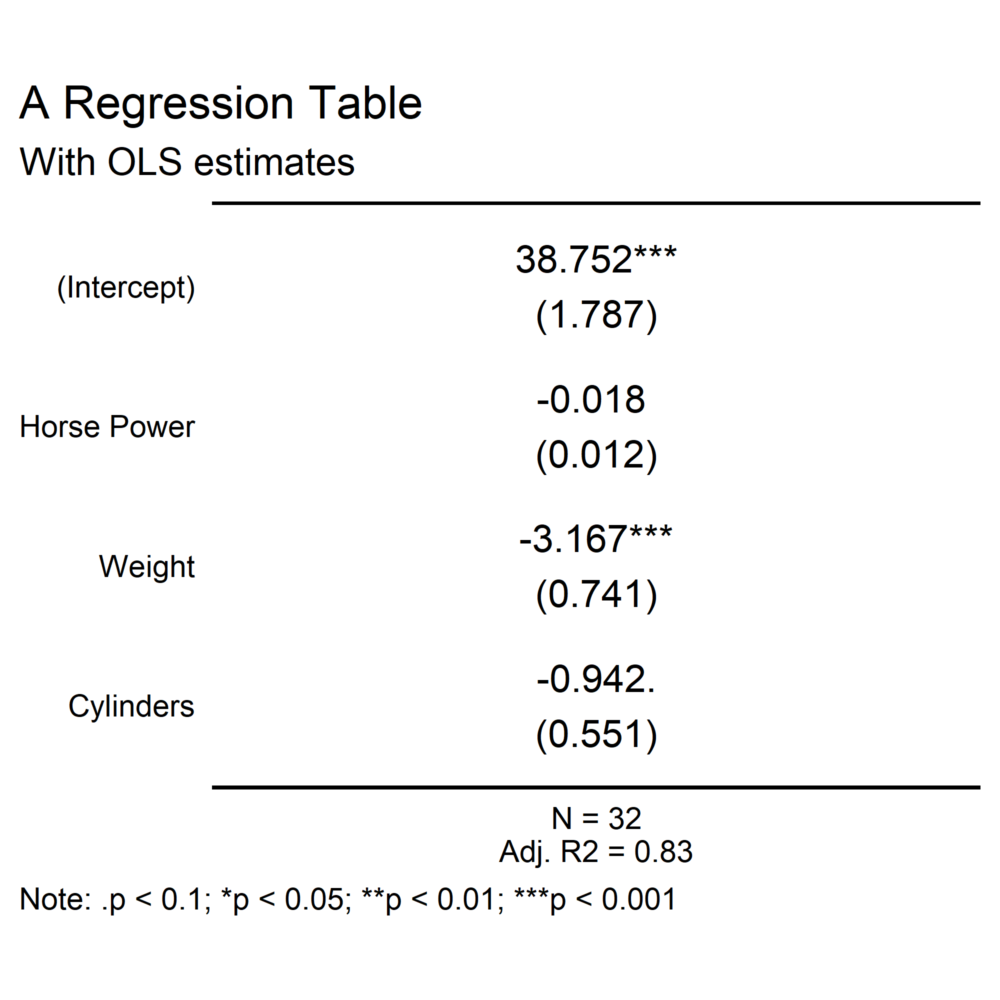
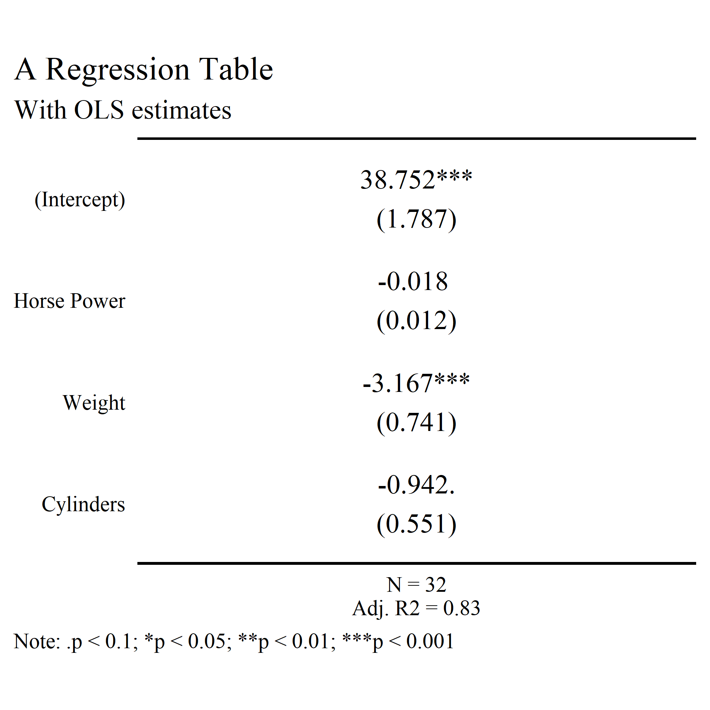
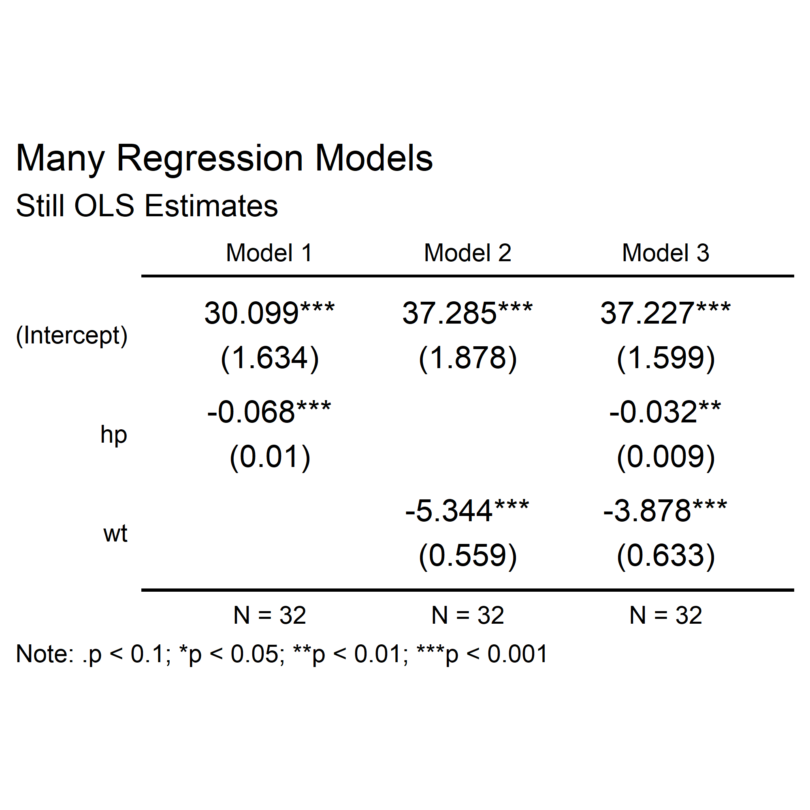
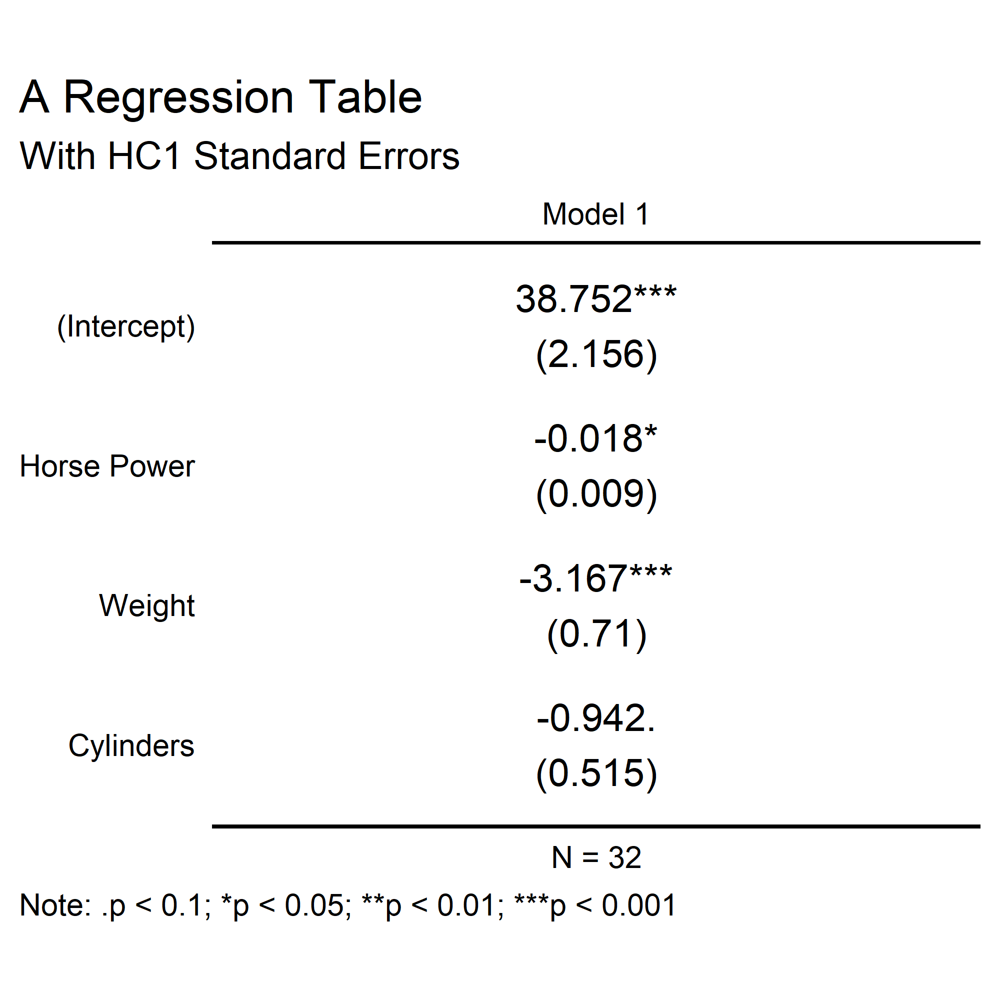

Introducing `{ggregtab}`
================

It’s yet another R package for making regression tables. Why?!

The `{ggregtab}` package is a hyper-specific solution to a
hyper-specific problem I’ve been having. As an academic researcher, I
love the look of pdfs that I can make of paper manuscripts using Quarto
and RMarkdown. Unfortunately, most of the journals that I submit my work
to want Word Documents. This is havoc for regression tables. The
placement of these is never formatted the way I like, and often I have
to contend with tables being split between two pages because of their
placement in my Quarto or RMarkdown file. This is frustrating to no end,
and I couldn’t find a solution other than editing my files after the
fact.

I then had a realization. I don’t have this problem with my figures
because they are rendered as images. That means they aren’t split
between pages. So what if I had a method for quickly making a figure
that just happens to look like a table?

Hence, I give you `{ggregtab}`. It produces ggplots that look like
regression tables.

To install the package just write:

``` r
install.packages("devtools")
devtools::install_github("milesdwilliams15/ggregtab")
```

## Main Functions

The main functions in the package are:

- `ggregtab()`
- `tidy_coeftest()`

`ggregtab()` produces a ggplot that looks like a regression table once
given a tidy coefficient test object.

Importantly, this object must contain eight unique columns. In addition
to the usual that are produced for model objects using `broom::tidy()`,
additional columns required are `conf.low`, `conf.high`, `model`, and
`N`. The first two are required if you want to show confidence intervals
instead of standard errors in your “tables.” The latter are required for
model labeling and for showing sample sizes.

`tidy_coeftest()` is a helper function that makes it easy to get your
model objects into the correct shape. You don’t have to use this
function, however, as long as the coefficient test object you give to
`ggregtab()` contains the requisite columns.

## An Example

Here’s some code that produces a regression table using data from the
`mtcars` dataset.

``` r
## open the package
library(ggregtab)

## fit a regression model
fit <- lm(mpg ~ hp + wt + cyl, mtcars)

## prep it for visualization
tidy_fit <- tidy_coeftest(fit)

## plot the regression table
ggregtab(tidy_fit)
```

<!-- -->

Looking inside the `tidy_fit` object produced using `tidy_coeftest()`,
it’s clear what shape the model summary needs to be in for plotting:

``` r
tidy_fit
```

    ## # A tibble: 4 × 9
    ##   term      estimate std.error statistic  p.value conf.low conf.high model     N
    ##   <chr>        <dbl>     <dbl>     <dbl>    <dbl>    <dbl>     <dbl> <chr> <int>
    ## 1 (Interce…  38.8       1.79       21.7  4.80e-19  35.2     42.3     Mode…    32
    ## 2 hp         -0.0180    0.0119     -1.52 1.40e- 1  -0.0413   0.00524 Mode…    32
    ## 3 wt         -3.17      0.741      -4.28 1.99e- 4  -4.62    -1.72    Mode…    32
    ## 4 cyl        -0.942     0.551      -1.71 9.85e- 2  -2.02     0.138   Mode…    32

## Advanced Options

There are many ways to customize the appearance of your regression
tables and the model summary statistics. I’ve included some examples
below.

### Updating Labels and Text

Since the output of `ggregtab()` is a `ggplot()` object, you can use all
the `{ggplot2}` extras you want to customize it. For example you can use
`+ labs()` to give your table a title and subtitle. You can also use
`scale_y_discrete()` to update the labels for the model terms.

``` r
ggregtab(tidy_fit) +
  labs(
    title = "A Regression Table",
    subtitle = "With OLS estimates"
  ) +
  scale_y_discrete(
    labels = c(
      "Cylinders",
      "Weight",
      "Horse Power",
      "(Intercept)"
    )
  )
```

<!-- -->

You can include whatever summary stats you like for you models by
updating the x-axis labels. Note that to do this you need to use
`scale_x_continuous()`. Under the hood a continuous scale is used for
any and all model IDs. This was a round-about solution for making the
plot show a upper and lower axis label simultaneously—one for the model
stats and the other for the model title.

``` r
## get adjusted r-squared and N
smry_fit <- summary(fit)
rsqrd <- smry_fit$adj.r.squared
nobs <- nrow(model.frame(fit))

## paste together as a new label for the bottom x-axis
smry_stats <- paste0(
  "N = ", nobs, "\n",
  "Adj. R2 = ", round(rsqrd, 2)
)

## update the plot
ggregtab(tidy_fit) +
  labs(
    title = "A Regression Table",
    subtitle = "With OLS estimates"
  ) +
  scale_y_discrete(
    labels = c(
      "Cylinders",
      "Weight",
      "Horse Power",
      "(Intercept)"
    )
  ) +
  scale_x_continuous(
    breaks = 1,
    labels = smry_stats
  )
```

<!-- -->

One last thing I’ll show is that you can update the fonts of your
tables. Here’s an example using “serif”. I haven’t tested it, but I
assume you could use something like `{showtext}` to use a wider variety
of fonts than what are available by default with `{ggplot2}` as well.

``` r
ggregtab(tidy_fit, base_family = "serif") +
  labs(
    title = "A Regression Table",
    subtitle = "With OLS estimates"
  ) +
  scale_y_discrete(
    labels = c(
      "Cylinders",
      "Weight",
      "Horse Power",
      "(Intercept)"
    )
  ) +
  scale_x_continuous(
    breaks = 1,
    labels = smry_stats
  )
```

<!-- -->

## Multiple Models

You can show multiple regression models at once. When doing this, just
make sure that the tidy coefficient test object you give `ggregtab()`
has unique model IDs for each model you want to show. You can control
this using the `model` option in `tidy_coeftest()`.

``` r
fit1 <- lm(mpg ~ hp, mtcars)
fit2 <- lm(mpg ~ wt, mtcars)
fit3 <- lm(mpg ~ hp + wt, mtcars)

dplyr::bind_rows(
  tidy_coeftest(fit1, model = "Model 1"),
  tidy_coeftest(fit2, model = "Model 2"),
  tidy_coeftest(fit3, model = "Model 3")
) |>
  ggregtab(ratio = 1/2) +
  labs(
    title = "Many Regression Models",
    subtitle = "Still OLS Estimates"
  ) 
```

<!-- -->

### Using Robust or Clustered Standard Errors

Under the hood, `tidy_coeftest()` is using `lmtest::coeftest()`. This
function lets you supply your own variance-covariance matrix for
coefficient tests. `tidy_coeftest()` lets you pass such a matrix to
`coeftest()` using the same syntax. Just specify `vcov. = ...` and
provide your alternative variance-covariance matrix. This is useful if
you want to show robust or clustered standard errors.

You might do this using functions from the `{sandwich}` package, like
so:

``` r
tidy_coeftest(
  fit,
  vcov. = sandwich::vcovHC(fit, type = "HC1")
) |>
  ggregtab() +
  labs(
    title = "A Regression Table",
    subtitle = "With HC1 Standard Errors"
  ) +
  scale_y_discrete(
    labels = c(
      "Cylinders",
      "Weight",
      "Horse Power",
      "(Intercept)"
    )
  )
```

<!-- -->

### You Can Do Even More

I’ve just barely scratched the surface of what you can do. Since
`ggplot()` itself is so infinitely customizable, so are the tables you
can make with `ggregtab()`.

Have fun disguising ggplots as regression tables!
